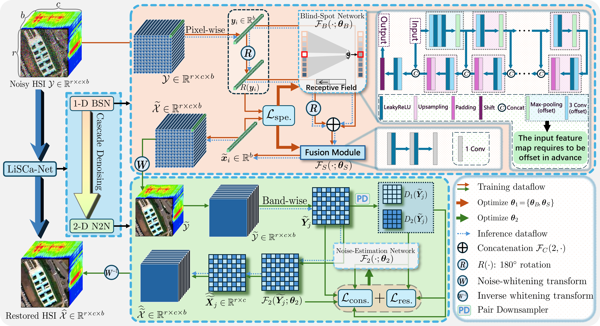

# LiSCa-Net
## Tongtong Wang; Lina Zhuang
[Link to paper](XXXXXXXXXXXXXX)

***
**Abstract:**
We propose a “spectral-priority” cascade denoising paradigm that decomposes mixed-noise removal into a serial two-stage pipeline–spectral purification followed by spatial refinement–systematically exploiting the intrinsic discriminative power in the spectral dimension against non-Gaussian degradations.
***
## Flowchart and Network Architecture



## Requirements
We tested the implementation in Python 3.10.

## Datasets
The test HSIs are available on [Google Drive](https://drive.google.com/drive/folders/1-xbTMAbYWZOrAcfL2MkyNOiW_hXPoRBq?usp=sharing). 
The folder contains clean HSIs and their corresponding noisy versions, simulated from the clean data according to the five noise cases described in the paper.

```
Put the downloaded data into the [Datasets] folder.

Alternatively, you can generate noisy HSIs according to the code.
```
## Denoising Experiments
```
cd LiSCa-Net
python run_exps_simu.py
```


## Bibtex
XXXXXX

## Contact Information
Tongtong Wang: [1822116421@qq.com](1822116421@qq.com)

Aerospace Information Research Institute

Chinese Academy of Sciences


