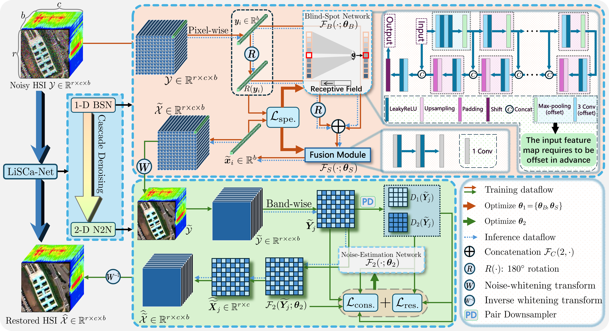

# LiSCa-Net
## Tongtong Wang, Michael K. Ng, Lianru Gao, and Lina Zhuang
[Link to paper](XXXXXXXXXXXXXX)

***
**Abstract:**
Hyperspectral image (HSI) denoising remains challenging due to the coexistence and superposition of diverse noise types with distinct statistical properties, while clean/noisy paired data are rarely available in real remote sensing scenarios for network training. 
Although recent self-supervised and unsupervised learning methods alleviate the need for clean references, they typically rely on large amounts of noisy images drawn from the same degradation distribution, leading to limited generalization when sensor degradations evolve over time. 
This raises a more practical yet challenging problem: how to train an effective denoising network using only a single noisy HSI under unknown mixed noise conditions.
To address the simultaneous challenges of multiple coexisting noise types, extremely limited training data, and the high dimensionality of HSIs, we propose a Lightweight Self-Supervised Spectral–Spatial Cascade Network (LiSCa-Net). 
LiSCa-Net is motivated by the observation that different noise types exhibit distinct statistical structures in the spectral and spatial domains and should therefore be modeled using networks with different inductive biases. 
Instead of employing a single network to jointly process the full hyperspectral data containing different noise types, LiSCa-Net adopts a two-stage cascade architecture. 
The first stage operates in the spectral domain, employing a pixel-wise 1-D blind-spot network that exploits inter-band correlation to suppress non-Gaussian sparse and structured noise without spatial interference. 
The second stage works in the spatial domain, where a noise-whitening transform equalizes band-wise variance, followed by a 2-D resampling-based Noise2Noise module to remove residual Gaussian noise.
Benefiting from stage-wise decoupling, LiSCa-Net contains only $26.2k$ parameters, making it suitable for resource-constrained and on-device deployment. 
Extensive experiments on simulated and real HSIs demonstrate that explicit spectral–spatial disentanglement is critical for efficient and robust zero-shot self-supervised HSI denoising, and its performance in terms of MPSNR, MSSIM and ERGAS is better than those by the other existing methods by 23.17\% in average.  

***
## Flowchart and Network Architecture



## Requirements
We tested the implementation in Python 3.10.

## Datasets
The test HSIs are available on [Google Drive](https://drive.google.com/drive/folders/1-xbTMAbYWZOrAcfL2MkyNOiW_hXPoRBq?usp=sharing). 
The folder contains clean HSIs and their corresponding noisy versions, simulated from the clean data according to the five noise cases described in the paper.

```
Put the downloaded data into the [Datasets] folder.

Alternatively, you can generate noisy HSIs according to the code.
```
## Denoising Experiments
```
cd LiSCa-Net
python run_exps_simu.py datasets.scene_name=WashingtonDC noise.case=case3 device=cuda gpu_ids=0 save_dir=./Result/
python run_exps_simu.py datasets.scene_name=pavia noise.case=case5
```


## Citation
If you find the code helpful in your resarch or work, please cite:
```
XXXXXXXXXXXXX
```

## Contact Information
Please contact me if there is any question. 
Tongtong Wang: [wangtongtong25@mails.ucas.ac.cn](wangtongtong25@mails.ucas.ac.cn)

Aerospace Information Research Institute

Chinese Academy of Sciences


